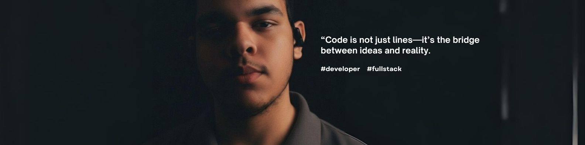

  

## Sobre mim

Sou **desenvolvedor** apaixonado por tecnologia, com formação em **Sistemas de Informação** pela UniFasipe (UF). Atualmente, estou cursando **Engenharia de Software** na UniBH (UB).

Tenho como objetivo transformar ideias em código, buscando constantemente novos desafios e aprendizados no universo da programação.

## Conhecimentos
Atualmente atuo como Programador Full Stack. Segue um resumo profissional das minhas competências técnicas e áreas de atuação:

- UX/UI Design: criação de interfaces, prototipagem e testes de usabilidade; experiência com ferramentas da família Adobe, Figma e boas práticas de design centrado no usuário.
- Linguagens de programação: Python, Java, JavaScript, PHP.
- Frameworks: Django, React, Next.js, TailwindCSS, Spring Boot, Node.js.
- Back-end: Node.js, Spring Boot, Django.
- Bancos de dados: PostgreSQL, MySQL, MariaDB.
- Ferramentas e produtividade: Adobe Creative Suite (Photoshop, Illustrator), Figma, Microsoft Office (Word, Excel, PowerPoint), controle de versão com Git.
- Metodologias: desenvolvimento ágil, revisão de código e integração contínua.

 

>  
> "Programs must be written for people to read, and only incidentally for machines to execute."  
> — Harold Abelson

 

  <a href="mailto:eueliseeu@gmail.com" title="Email">
    <svg xmlns="http://www.w3.org/2000/svg" width="24" height="24" viewBox="0 0 24 24" fill="none" stroke="currentColor" stroke-width="2" stroke-linecap="round" stroke-linejoin="round"><rect x="3" y="5" width="18" height="14" rx="2" /><polyline points="3 7 12 13 21 7" /></svg>
  </a>
  &nbsp;
  <a href="https://www.linkedin.com/in/eueliseeu" title="LinkedIn">
    <svg xmlns="http://www.w3.org/2000/svg" width="24" height="24" viewBox="0 0 24 24" fill="none" stroke="currentColor" stroke-width="2" stroke-linecap="round" stroke-linejoin="round"><rect x="2" y="2" width="20" height="20" rx="2" /><line x1="8" y1="11" x2="8" y2="16" /><line x1="8" y1="8" x2="8" y2="8" /><line x1="12" y1="11" x2="12" y2="16" /><path d="M16 11v2a2 2 0 0 1-2 2h0a2 2 0 0 1-2-2v-2" /></svg>
  </a>
  &nbsp;
  <a href="https://www.instagram.com/eueliseeu" title="Instagram">
    <svg xmlns="http://www.w3.org/2000/svg" width="24" height="24" viewBox="0 0 24 24" fill="none" stroke="currentColor" stroke-width="2" stroke-linecap="round" stroke-linejoin="round" class="lucide lucide-instagram-icon lucide-instagram"><rect width="20" height="20" x="2" y="2" rx="5" ry="5"/><path d="M16 11.37A4 4 0 1 1 12.63 8 4 4 0 0 1 16 11.37z"/><line x1="17.5" x2="17.51" y1="6.5" y2="6.5"/></svg>
  </a>

